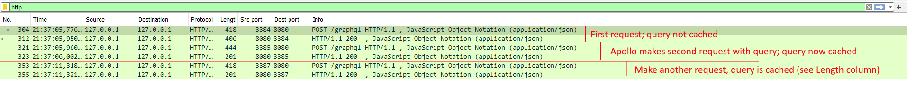
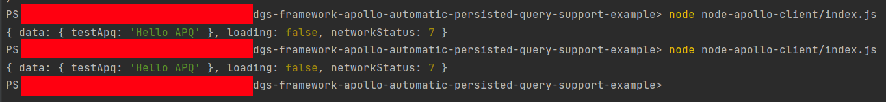

# DGS Framework + Apollo Automatic Persisted Queries

The key to solving https://github.com/Netflix/dgs-framework/issues/905 is to add a dependency on
Caffeine: `implementation("com.github.ben-manes.caffeine:caffeine")`

## Usage

Start the DGS Framework server:

```shell
cd jvm-dgs
./gradlew bootRun
```

Or PowerShell:

```shell
cd jvm-dgs
.\gradlew.bat bootRun
```

Install Node dependencies:

```shell
yarn install --frozen-lockfile
```

Wait for it to start, then start the Node app:

```shell
node node-apollo-client/index.js
```

The second time there will only be one request as the query is cached.

## Wireshark output



## Expected program output


